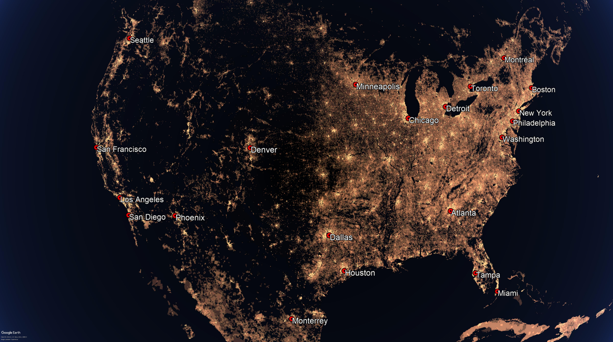

# Introduction

This is a small project I devised to practice my Python skills. I used population density data from the Socioeconomic Data and Applications Center (SEDAC) to create a heatmap of global population density. More information about the dataset can be found here: http://sedac.ciesin.columbia.edu/data/set/gpw-v4-population-density-rev11. I used Python to read, clean, and manipulate the data, then export it as an image. For visualization, I generated a KML file that overlaid the heatmap onto Google Earth.

For quick visual reference, I also added placemarks labeling the world's most populated cities. To do this, I generated a separate KML file using data from here: https://simplemaps.com/data/world-cities.

Here is a sample screenshot of the US with both KML files loaded into Google Earth:

